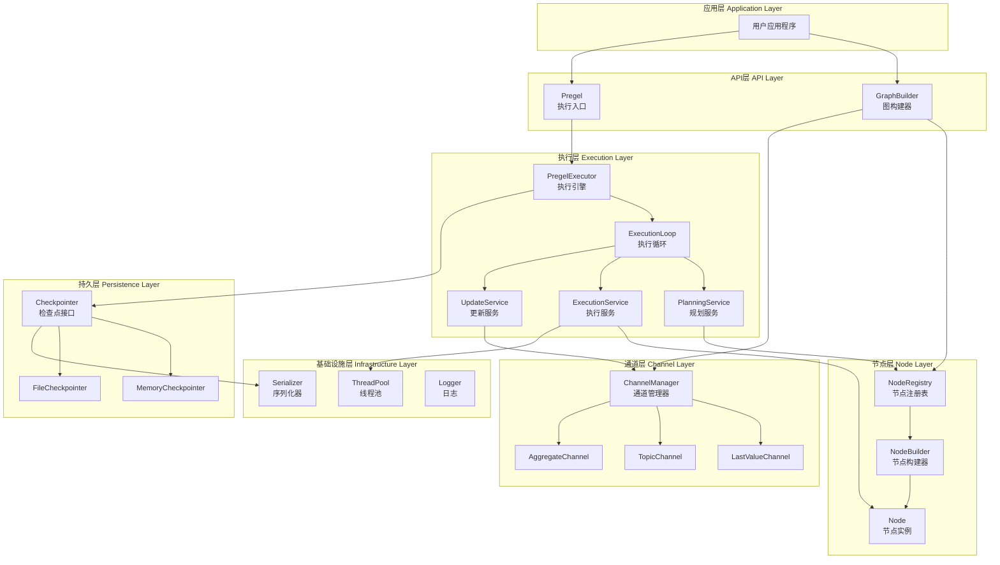
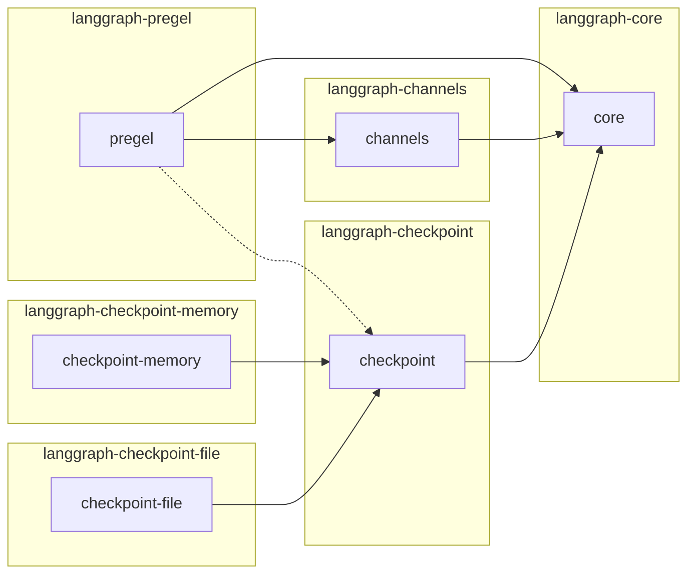
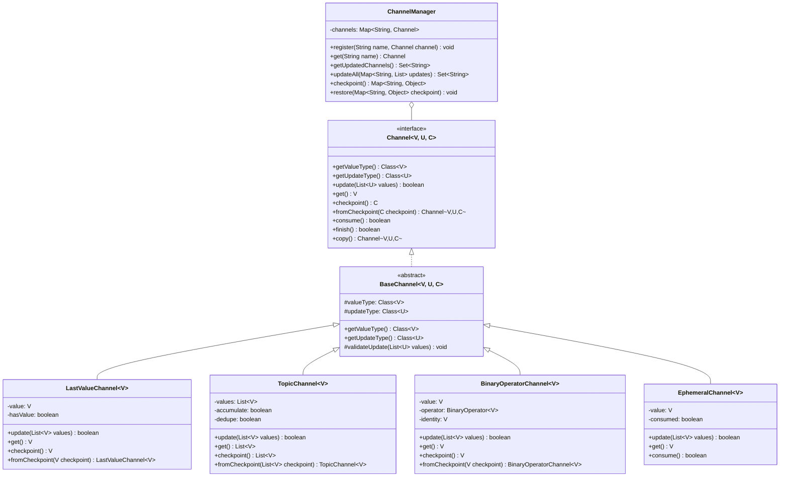
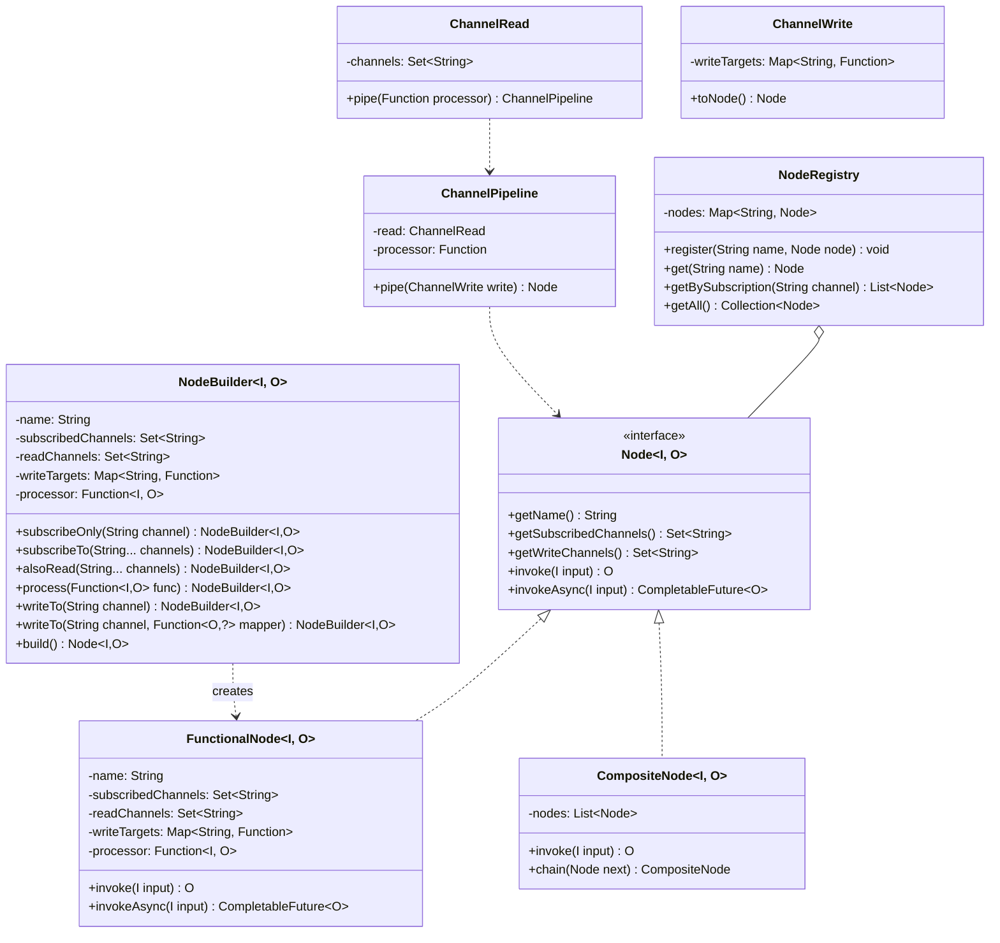
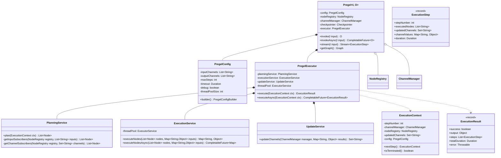
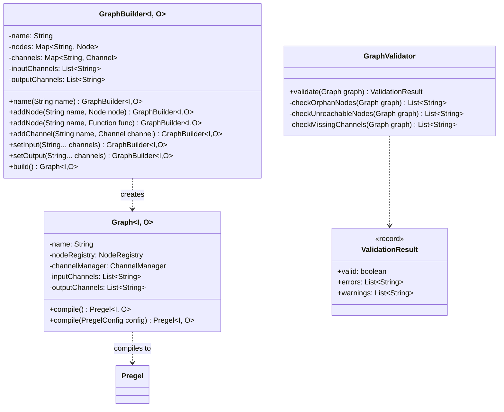
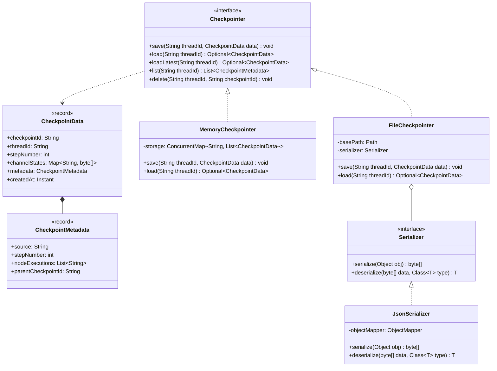
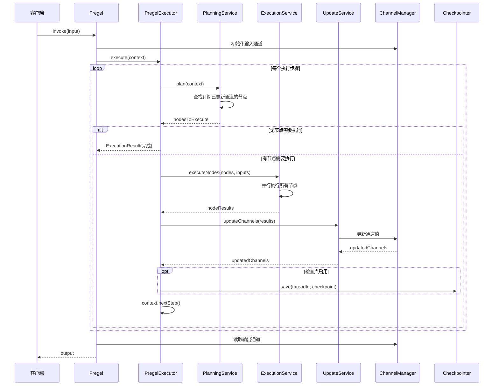
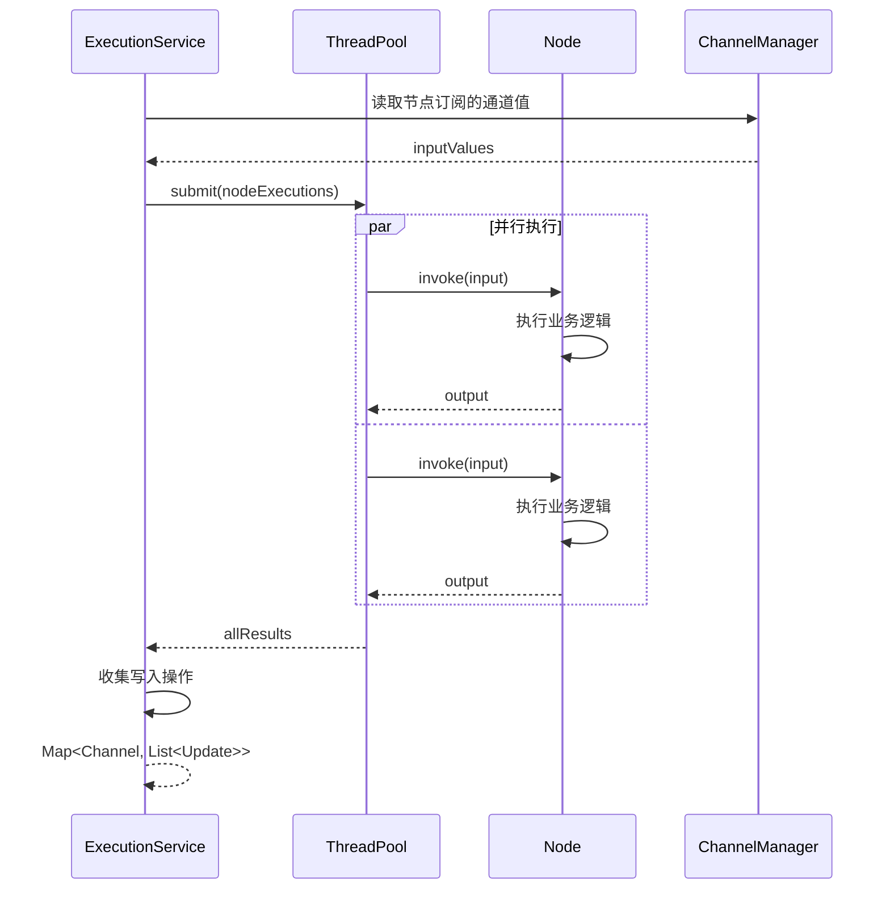
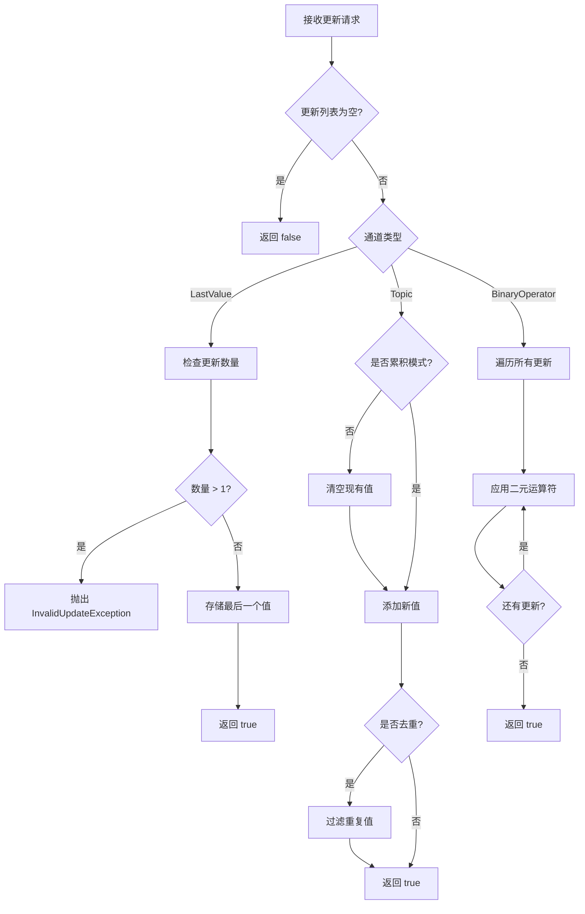

# LangGraph Java 实现需求规格说明书

## 版本信息

- **目标版本**: LangGraph-Java v0.0.8
- **参考实现**: LangGraph Python v0.0.8
- **Java 版本要求**: Java 21（使用 Record、Sealed Class、Pattern Matching）

------

## 1. 项目概述

### 1.1 项目目标

将 LangGraph v0.0.8 的核心功能迁移至 Java 平台，实现一个**有状态的多 Actor 图执行框架**，支持：

- 基于 Pregel/BSP 模型的并行执行
- Channel 驱动的消息传递机制
- 支持循环的图结构
- 可扩展的检查点机制

### 1.2 设计原则

| 原则               | 说明                                     |
| ------------------ | ---------------------------------------- |
| **类型安全**       | 充分利用 Java 泛型系统确保编译时类型检查 |
| **不可变优先**     | 状态对象优先使用不可变设计（Record）     |
| **函数式友好**     | 支持 Lambda 和函数式接口                 |
| **并发安全**       | 使用现代并发 API（CompletableFuture）    |
| **可扩展**         | 通过接口和 SPI 机制支持扩展              |
| **零外部依赖核心** | 核心模块仅依赖 JDK                       |

------

## 2. 功能需求列表

### 2.1 核心功能需求

#### FR-001: Channel 通道系统

| 需求ID    | 需求描述                                                | 优先级 |
| --------- | ------------------------------------------------------- | ------ |
| FR-001-01 | 实现 Channel 抽象接口，定义值类型、更新类型、检查点类型 | P0     |
| FR-001-02 | 实现 LastValue Channel，存储最后一个值                  | P0     |
| FR-001-03 | 实现 Topic Channel，支持 PubSub 模式                    | P0     |
| FR-001-04 | 实现 BinaryOperatorAggregate Channel，支持聚合运算      | P0     |
| FR-001-05 | 实现 EphemeralValue Channel，临时值通道                 | P1     |
| FR-001-06 | Channel 支持序列化和反序列化（检查点）                  | P1     |
| FR-001-07 | 支持自定义 Channel 扩展                                 | P2     |

#### FR-002: Pregel 执行引擎

| 需求ID    | 需求描述                                        | 优先级 |
| --------- | ----------------------------------------------- | ------ |
| FR-002-01 | 实现 Pregel 核心执行循环（Plan-Execute-Update） | P0     |
| FR-002-02 | 支持同步执行（invoke）                          | P0     |
| FR-002-03 | 支持异步执行（invokeAsync）                     | P0     |
| FR-002-04 | 支持流式执行（stream）                          | P1     |
| FR-002-05 | 实现最大步数限制                                | P0     |
| FR-002-06 | 实现执行超时控制                                | P1     |
| FR-002-07 | 支持调试模式（详细日志）                        | P2     |
| FR-002-08 | 支持执行取消                                    | P2     |

#### FR-003: 节点/链系统

| 需求ID    | 需求描述                         | 优先级 |
| --------- | -------------------------------- | ------ |
| FR-003-01 | 定义 Node（节点）抽象接口        | P0     |
| FR-003-02 | 支持 Lambda/函数式节点定义       | P0     |
| FR-003-03 | 实现节点的通道订阅机制           | P0     |
| FR-003-04 | 实现节点的通道写入机制           | P0     |
| FR-003-05 | 支持条件写入（写入 null 时跳过） | P0     |
| FR-003-06 | 支持节点组合（链式调用）         | P1     |

#### FR-004: 图构建 API

| 需求ID    | 需求描述                     | 优先级 |
| --------- | ---------------------------- | ------ |
| FR-004-01 | 实现 GraphBuilder 流式构建器 | P0     |
| FR-004-02 | 支持节点注册                 | P0     |
| FR-004-03 | 支持自定义通道配置           | P0     |
| FR-004-04 | 支持输入/输出通道指定        | P0     |
| FR-004-05 | 实现图验证（检测孤立节点等） | P1     |
| FR-004-06 | 支持图的可视化导出           | P2     |

#### FR-005: 检查点系统

| 需求ID    | 需求描述               | 优先级 |
| --------- | ---------------------- | ------ |
| FR-005-01 | 定义 Checkpointer 接口 | P1     |
| FR-005-02 | 实现内存检查点存储     | P1     |
| FR-005-03 | 支持从检查点恢复执行   | P1     |
| FR-005-04 | 实现文件系统检查点存储 | P2     |
| FR-005-05 | 支持检查点加密         | P3     |

### 2.2 非功能需求

| 需求ID  | 需求描述         | 指标                  |
| ------- | ---------------- | --------------------- |
| NFR-001 | 单节点执行延迟   | < 1ms（不含业务逻辑） |
| NFR-002 | 并发节点执行效率 | 线性扩展至 CPU 核心数 |
| NFR-003 | 内存占用         | 单图 < 10MB（空载）   |
| NFR-004 | 线程安全         | 所有公共 API 线程安全 |
| NFR-005 | 代码覆盖率       | > 80%                 |

------

## 3. 系统架构

### 3.1 整体架构视图



### 3.2 模块依赖关系



### 3.3 包结构设计

```
com.langgraph
├── core                          # 核心模块
│   ├── types                     # 基础类型定义
│   │   ├── Value.java
│   │   ├── Update.java
│   │   └── Checkpoint.java
│   ├── exceptions                # 异常定义
│   │   ├── LangGraphException.java
│   │   ├── EmptyChannelException.java
│   │   ├── InvalidUpdateException.java
│   │   └── ExecutionException.java
│   ├── functional                # 函数式接口
│   │   ├── NodeFunction.java
│   │   ├── ChannelReader.java
│   │   └── ChannelWriter.java
│   └── utils                     # 工具类
│       ├── TypeUtils.java
│       └── ValidationUtils.java
│
├── channels                      # 通道模块
│   ├── Channel.java              # 通道接口
│   ├── BaseChannel.java          # 抽象基类
│   ├── LastValueChannel.java     # 最后值通道
│   ├── TopicChannel.java         # 主题通道
│   ├── BinaryOperatorChannel.java# 聚合通道
│   ├── EphemeralChannel.java     # 临时通道
│   ├── ChannelManager.java       # 通道管理器
│   └── ChannelConfig.java        # 通道配置
│
├── nodes                         # 节点模块
│   ├── Node.java                 # 节点接口
│   ├── NodeBuilder.java          # 节点构建器
│   ├── FunctionalNode.java       # 函数式节点
│   ├── CompositeNode.java        # 组合节点
│   ├── NodeRegistry.java         # 节点注册表
│   └── NodeConfig.java           # 节点配置
│
├── pregel                        # 执行引擎模块
│   ├── Pregel.java               # 主入口类
│   ├── PregelConfig.java         # 配置类
│   ├── PregelExecutor.java       # 执行器
│   ├── ExecutionContext.java     # 执行上下文
│   ├── ExecutionStep.java        # 执行步骤
│   ├── ExecutionResult.java      # 执行结果
│   └── internal                  # 内部实现
│       ├── PlanningService.java
│       ├── ExecutionService.java
│       └── UpdateService.java
│
├── graph                         # 图构建模块
│   ├── Graph.java                # 图定义
│   ├── GraphBuilder.java         # 图构建器
│   ├── GraphValidator.java       # 图验证器
│   └── GraphVisualizer.java      # 图可视化
│
├── checkpoint                    # 检查点模块
│   ├── Checkpointer.java         # 检查点接口
│   ├── CheckpointData.java       # 检查点数据
│   ├── CheckpointMetadata.java   # 检查点元数据
│   ├── Serializer.java           # 序列化接口
│   └── JsonSerializer.java       # JSON序列化实现
│
└── spi                           # SPI扩展点
    ├── ChannelProvider.java
    ├── CheckpointerProvider.java
    └── SerializerProvider.java
```

------

## 4. 核心类图设计

### 4.1 Channel 模块类图



### 4.2 Node 模块类图



### 4.3 Pregel 执行引擎类图



### 4.4 Graph 构建器类图



### 4.5 Checkpoint 模块类图



------

## 5. 核心流程设计

### 5.1 图执行主流程



### 5.2 节点执行流程



### 5.3 Channel 更新流程



------

## 6. 关键接口定义

### 6.1 Channel 接口

```java
/**
 * 通道接口 - LangGraph 中组件间通信的核心抽象
 *
 * @param <V> 值类型 - 通道中存储的数据类型
 * @param <U> 更新类型 - 发送到通道的更新数据类型
 * @param <C> 检查点类型 - 可序列化的状态表示类型
 */
public interface Channel<V, U, C> {
    
    /**
     * 获取通道名称
     */
    String getName();
    
    /**
     * 获取值类型
     */
    Class<V> getValueType();
    
    /**
     * 获取更新类型
     */
    Class<U> getUpdateType();
    
    /**
     * 用给定的更新序列更新通道的值
     * 在每个步骤结束时由 Pregel 调用
     *
     * @param values 更新序列（顺序任意）
     * @return 如果通道被更新返回 true
     * @throws InvalidUpdateException 如果更新序列无效
     */
    boolean update(List<U> values);
    
    /**
     * 返回通道的当前值
     *
     * @return 当前值
     * @throws EmptyChannelException 如果通道为空
     */
    V get();
    
    /**
     * 返回通道当前状态的可序列化表示
     *
     * @return 检查点数据
     * @throws EmptyChannelException 如果不支持检查点
     */
    C checkpoint();
    
    /**
     * 从检查点恢复通道状态
     *
     * @param checkpoint 检查点数据
     * @return 恢复后的通道实例
     */
    Channel<V, U, C> fromCheckpoint(C checkpoint);
    
    /**
     * 通知通道订阅的任务已运行
     * 用于修改状态，防止值被再次消费
     *
     * @return 如果通道被更新返回 true
     */
    default boolean consume() {
        return false;
    }
    
    /**
     * 通知通道 Pregel 运行正在结束
     *
     * @return 如果通道被更新返回 true
     */
    default boolean finish() {
        return false;
    }
    
    /**
     * 返回通道的副本
     */
    Channel<V, U, C> copy();
}
```

### 6.2 Node 接口

```java
/**
 * 节点接口 - 图中的可执行单元
 *
 * @param <I> 输入类型
 * @param <O> 输出类型
 */
public interface Node<I, O> {
    
    /**
     * 获取节点名称
     */
    String getName();
    
    /**
     * 获取节点订阅的通道集合
     * 当这些通道更新时，节点会被触发执行
     */
    Set<String> getSubscribedChannels();
    
    /**
     * 获取节点额外读取的通道集合（不触发执行）
     */
    default Set<String> getReadChannels() {
        return Collections.emptySet();
    }
    
    /**
     * 获取节点写入的通道配置
     * Key: 通道名称
     * Value: 输出值到通道值的映射函数（可为null表示直接写入）
     */
    Map<String, Function<O, ?>> getWriteTargets();
    
    /**
     * 同步执行节点
     *
     * @param input 输入数据
     * @return 输出数据
     */
    O invoke(I input);
    
    /**
     * 异步执行节点
     *
     * @param input 输入数据
     * @return 包含输出数据的 CompletableFuture
     */
    default CompletableFuture<O> invokeAsync(I input) {
        return CompletableFuture.supplyAsync(() -> invoke(input));
    }
}
```

### 6.3 Pregel 接口

```java
/**
 * Pregel 执行引擎 - LangGraph 的核心运行时
 *
 * @param <I> 输入类型
 * @param <O> 输出类型
 */
public interface PregelGraph<I, O> {
    
    /**
     * 同步执行图
     *
     * @param input 输入数据
     * @return 输出数据
     */
    O invoke(I input);
    
    /**
     * 带配置的同步执行
     *
     * @param input 输入数据
     * @param config 运行时配置
     * @return 输出数据
     */
    O invoke(I input, RuntimeConfig config);
    
    /**
     * 异步执行图
     *
     * @param input 输入数据
     * @return 包含输出数据的 CompletableFuture
     */
    CompletableFuture<O> invokeAsync(I input);
    
    /**
     * 流式执行，逐步返回执行步骤
     *
     * @param input 输入数据
     * @return 执行步骤的流
     */
    Stream<ExecutionStep> stream(I input);
    
    /**
     * 从检查点恢复执行
     *
     * @param threadId 线程ID
     * @param checkpointId 检查点ID
     * @return 恢复后的输出
     */
    O resumeFrom(String threadId, String checkpointId);
    
    /**
     * 获取图定义
     */
    Graph<I, O> getGraph();
    
    /**
     * 获取当前配置
     */
    PregelConfig getConfig();
}
```

------

## 7. 配置类设计

### 7.1 PregelConfig

```java
/**
 * Pregel 配置类
 */
public record PregelConfig(
    List<String> inputChannels,
    List<String> outputChannels,
    int maxSteps,
    Duration timeout,
    boolean debug,
    int threadPoolSize,
    boolean checkpointEnabled,
    Duration checkpointInterval
) {
    // 默认值
    public static final int DEFAULT_MAX_STEPS = 100;
    public static final Duration DEFAULT_TIMEOUT = Duration.ofMinutes(5);
    public static final int DEFAULT_THREAD_POOL_SIZE = 
        Runtime.getRuntime().availableProcessors();
    
    public static Builder builder() {
        return new Builder();
    }
    
    public static class Builder {
        private List<String> inputChannels = new ArrayList<>();
        private List<String> outputChannels = new ArrayList<>();
        private int maxSteps = DEFAULT_MAX_STEPS;
        private Duration timeout = DEFAULT_TIMEOUT;
        private boolean debug = false;
        private int threadPoolSize = DEFAULT_THREAD_POOL_SIZE;
        private boolean checkpointEnabled = false;
        private Duration checkpointInterval = Duration.ofSeconds(30);
        
        public Builder inputChannels(String... channels) {
            this.inputChannels = Arrays.asList(channels);
            return this;
        }
        
        public Builder outputChannels(String... channels) {
            this.outputChannels = Arrays.asList(channels);
            return this;
        }
        
        public Builder maxSteps(int maxSteps) {
            this.maxSteps = maxSteps;
            return this;
        }
        
        public Builder timeout(Duration timeout) {
            this.timeout = timeout;
            return this;
        }
        
        public Builder debug(boolean debug) {
            this.debug = debug;
            return this;
        }
        
        public Builder threadPoolSize(int size) {
            this.threadPoolSize = size;
            return this;
        }
        
        public Builder enableCheckpoint(boolean enabled) {
            this.checkpointEnabled = enabled;
            return this;
        }
        
        public PregelConfig build() {
            return new PregelConfig(
                inputChannels, outputChannels, maxSteps, timeout,
                debug, threadPoolSize, checkpointEnabled, checkpointInterval
            );
        }
    }
}
```

------

## 8. 使用示例设计

### 8.1 基础使用示例

```java
// 示例1：简单的值处理管道
public class SimpleExample {
    public static void main(String[] args) {
        // 方式1：使用 NodeBuilder
        Node<String, String> processNode = NodeBuilder.<String, String>create("process")
            .subscribeOnly("input")
            .process(str -> str.toUpperCase())
            .writeTo("output")
            .build();
        
        // 构建图
        Graph<String, String> graph = GraphBuilder.<String, String>create()
            .name("simple-graph")
            .addNode("process", processNode)
            .setInput("input")
            .setOutput("output")
            .build();
        
        // 编译并执行
        PregelGraph<String, String> app = graph.compile();
        String result = app.invoke("hello");
        System.out.println(result); // "HELLO"
        
        // 方式2：使用流式 API（Channel.subscribeTo 风格）
        PregelGraph<String, String> app2 = Pregel.<String, String>builder()
            .addChain("process", 
                Channel.subscribeTo("input")
                    .pipe(str -> str.toUpperCase())
                    .pipe(Channel.writeTo("output")))
            .input("input")
            .output("output")
            .build();
    }
}
```

### 8.2 循环图示例

```java
// 示例2：带循环的图（值自增长）
public class LoopExample {
    public static void main(String[] args) {
        Node<String, String> growNode = NodeBuilder.<String, String>create("grow")
            .subscribeOnly("value")
            .process(str -> str + str) // 值翻倍
            .writeTo("value", str -> str.length() < 10 ? str : null) // 条件写入
            .build();
        
        Graph<String, String> graph = GraphBuilder.<String, String>create()
            .addNode("grow", growNode)
            .setInput("value")
            .setOutput("value")
            .build();
        
        PregelGraph<String, String> app = graph.compile(
            PregelConfig.builder()
                .maxSteps(20)
                .debug(true)
                .build()
        );
        
        String result = app.invoke("a");
        System.out.println(result); // "aaaaaaaa"
    }
}
```

### 8.3 多节点并行示例

```java
// 示例3：多节点并行处理
public class ParallelExample {
    public static void main(String[] args) {
        // 分支节点A
        Node<String, String> branchA = NodeBuilder.<String, String>create("branchA")
            .subscribeOnly("input")
            .process(str -> "A:" + str)
            .writeTo("resultA")
            .build();
        
        // 分支节点B
        Node<String, String> branchB = NodeBuilder.<String, String>create("branchB")
            .subscribeOnly("input")
            .process(str -> "B:" + str)
            .writeTo("resultB")
            .build();
        
        // 合并节点
        Node<Map<String, String>, String> merge = NodeBuilder
            .<Map<String, String>, String>create("merge")
            .subscribeTo("resultA", "resultB")
            .process(inputs -> inputs.get("resultA") + " | " + inputs.get("resultB"))
            .writeTo("output")
            .build();
        
        Graph<String, String> graph = GraphBuilder.<String, String>create()
            .addNode("branchA", branchA)
            .addNode("branchB", branchB)
            .addNode("merge", merge)
            .setInput("input")
            .setOutput("output")
            .build();
        
        String result = graph.compile().invoke("data");
        // 结果: "A:data | B:data"
    }
}
```

### 8.4 聚合通道示例

```java
// 示例4：使用聚合通道
public class AggregateExample {
    public static void main(String[] args) {
        Node<Integer, Integer> addNode = NodeBuilder.<Integer, Integer>create("add")
            .subscribeOnly("numbers")
            .process(n -> n)
            .writeTo("sum")
            .build();
        
        Graph<Integer, Integer> graph = GraphBuilder.<Integer, Integer>create()
            .addNode("add", addNode)
            .addChannel("sum", new BinaryOperatorChannel<>(
                Integer.class, 
                Integer::sum, 
                0 // identity
            ))
            .setInput("numbers")
            .setOutput("sum")
            .build();
        
        // 使用 Topic 通道发送多个值
        // ...
    }
}
```

------

## 9. 测试策略

### 9.1 测试分层

| 层级     | 测试类型                 | 覆盖目标         |
| -------- | ------------------------ | ---------------- |
| 单元测试 | JUnit 5                  | 各个类的独立功能 |
| 集成测试 | JUnit 5 + Testcontainers | 模块间交互       |
| 性能测试 | JMH                      | 执行效率基准     |
| 并发测试 | jcstress                 | 线程安全验证     |

### 9.2 关键测试用例

```java
// Channel 测试
@Test
void lastValueChannel_shouldStoreLastValue() {
    var channel = new LastValueChannel<>(String.class);
    channel.update(List.of("first"));
    channel.update(List.of("second"));
    assertEquals("second", channel.get());
}

@Test
void lastValueChannel_shouldRejectMultipleUpdates() {
    var channel = new LastValueChannel<>(String.class);
    assertThrows(InvalidUpdateException.class, 
        () -> channel.update(List.of("a", "b")));
}

// Pregel 执行测试
@Test
void pregel_shouldExecuteNodesInCorrectOrder() {
    // ... 验证 Plan-Execute-Update 循环
}

@Test
void pregel_shouldSupportCyclicGraph() {
    // ... 验证循环图执行
}

@Test
void pregel_shouldRespectMaxSteps() {
    // ... 验证最大步数限制
}
```

------

## 10. 交付物清单

### 10.1 代码交付物

| 模块                 | 描述                   | 预估工作量 |
| -------------------- | ---------------------- | ---------- |
| langgraph-core       | 核心类型、异常、工具类 | 2人天      |
| langgraph-channels   | Channel 实现           | 3人天      |
| langgraph-nodes      | Node 系统              | 3人天      |
| langgraph-pregel     | 执行引擎               | 5人天      |
| langgraph-graph      | 图构建 API             | 2人天      |
| langgraph-checkpoint | 检查点系统             | 3人天      |
| 单元测试             | 全模块覆盖             | 4人天      |
| 集成测试             | 端到端测试             | 2人天      |
| **总计**             |                        | **24人天** |

### 10.2 文档交付物

- [ ] API JavaDoc
- [ ] 用户指南
- [ ] 架构设计文档
- [ ] 示例代码库

------

## 11. 风险与缓解措施

| 风险                                    | 影响 | 概率 | 缓解措施                               |
| --------------------------------------- | ---- | ---- | -------------------------------------- |
| Java 泛型类型擦除导致运行时类型信息丢失 | 中   | 高   | 使用 TypeToken 模式保留类型信息        |
| 并发执行时的竞态条件                    | 高   | 中   | 使用不可变对象和线程安全集合           |
| 序列化兼容性问题                        | 中   | 中   | 使用 JSON 序列化，避免 Java 原生序列化 |
| 内存泄漏（长时间运行的图）              | 高   | 低   | 实现资源清理机制和弱引用缓存           |

------

## 附录 A: 术语表

| 术语       | 定义                                        |
| ---------- | ------------------------------------------- |
| Channel    | 组件间通信的抽象，类似于消息队列            |
| Node       | 图中的可执行单元，消费和产生数据            |
| Pregel     | 基于 Google Pregel 算法的执行引擎           |
| BSP        | Bulk Synchronous Parallel，批量同步并行模型 |
| Step       | 执行的一个完整周期（Plan-Execute-Update）   |
| Checkpoint | 执行状态的可恢复快照                        |