# LangGraph Java 架构图集

## 1. 系统分层架构图

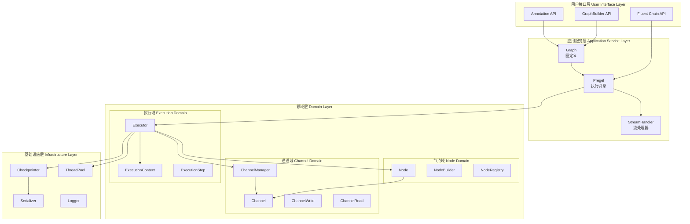

## 2. 执行引擎状态机

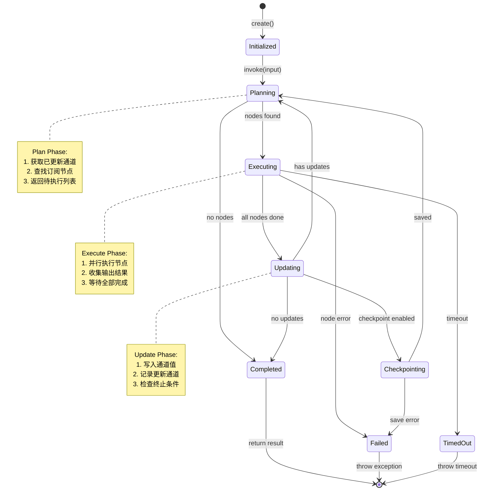

## 3. 完整类继承关系图

```mermaid
classDiagram
    %% 异常体系
    class LangGraphException {
        <<abstract>>
        +getMessage() String
        +getCause() Throwable
    }
    class EmptyChannelException
    class InvalidUpdateException
    class ExecutionException
    class GraphValidationException
    class CheckpointException
    
    LangGraphException <|-- EmptyChannelException
    LangGraphException <|-- InvalidUpdateException
    LangGraphException <|-- ExecutionException
    LangGraphException <|-- GraphValidationException
    LangGraphException <|-- CheckpointException
    
    %% 函数式接口
    class NodeFunction~I,O~ {
        <<interface>>
        +apply(I input) O
    }
    class ChannelMapper~T,R~ {
        <<interface>>
        +map(T value) R
    }
    class UpdateValidator~U~ {
        <<interface>>
        +validate(List~U~ updates) boolean
    }
    
    %% Channel 体系
    class Channel~V,U,C~ {
        <<interface>>
    }
    class BaseChannel~V,U,C~ {
        <<abstract>>
    }
    class LastValueChannel~V~
    class TopicChannel~V~
    class BinaryOperatorChannel~V~
    class EphemeralChannel~V~
    class ContextChannel~V~
    
    Channel <|.. BaseChannel
    BaseChannel <|-- LastValueChannel
    BaseChannel <|-- TopicChannel
    BaseChannel <|-- BinaryOperatorChannel
    BaseChannel <|-- EphemeralChannel
    BaseChannel <|-- ContextChannel
    
    %% Node 体系
    class Node~I,O~ {
        <<interface>>
    }
    class AbstractNode~I,O~ {
        <<abstract>>
    }
    class FunctionalNode~I,O~
    class CompositeNode~I,O~
    class ConditionalNode~I,O~
    class RetryNode~I,O~
    
    Node <|.. AbstractNode
    AbstractNode <|-- FunctionalNode
    AbstractNode <|-- CompositeNode
    AbstractNode <|-- ConditionalNode
    AbstractNode <|-- RetryNode
    
    %% Checkpointer 体系
    class Checkpointer {
        <<interface>>
    }
    class AbstractCheckpointer {
        <<abstract>>
    }
    class MemoryCheckpointer
    class FileCheckpointer
    class JdbcCheckpointer
    
    Checkpointer <|.. AbstractCheckpointer
    AbstractCheckpointer <|-- MemoryCheckpointer
    AbstractCheckpointer <|-- FileCheckpointer
    AbstractCheckpointer <|-- JdbcCheckpointer
```

## 4. Channel 详细类图

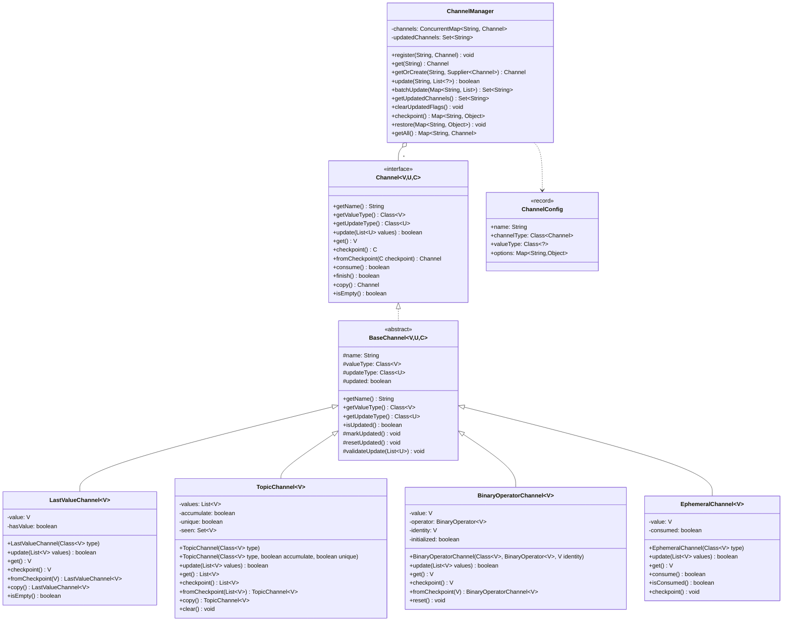

## 5. Node 详细类图

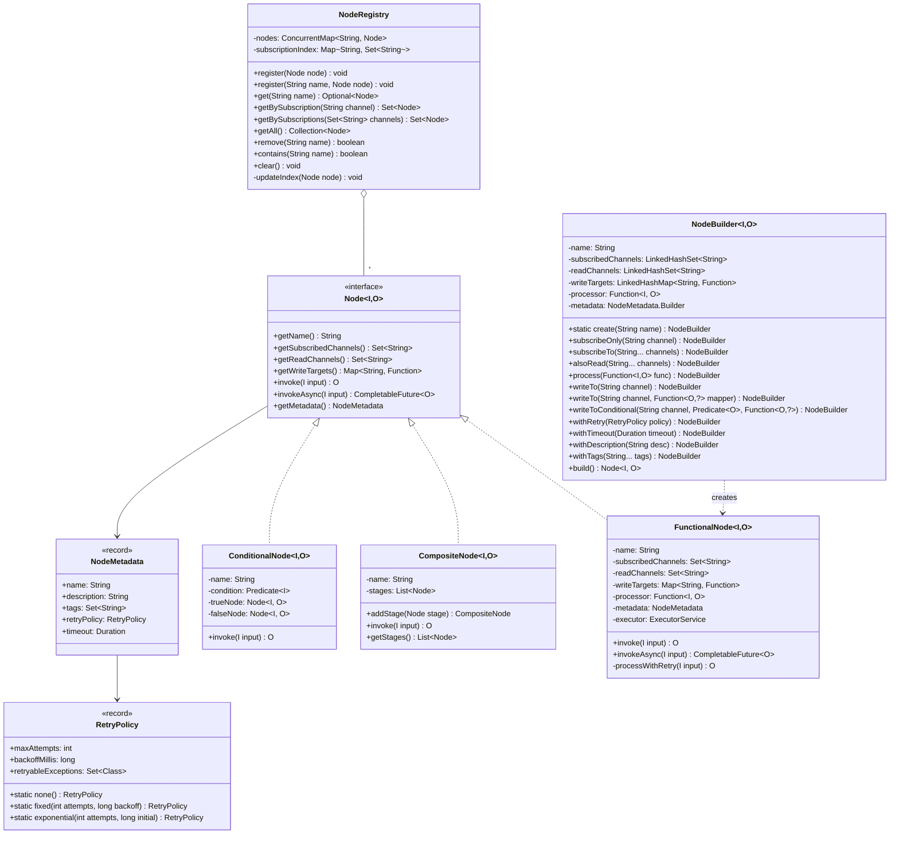

## 6. Pregel 执行引擎详细类图

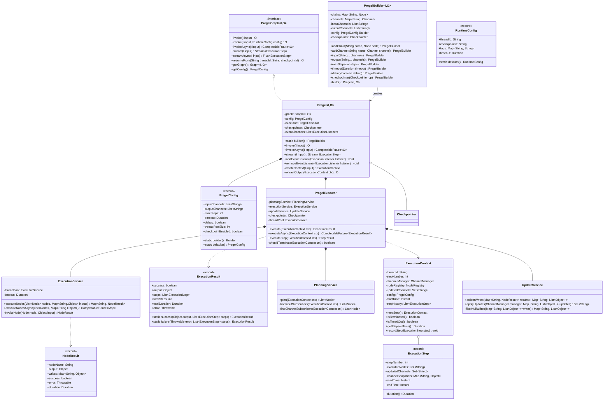

## 7. Graph 构建器详细类图

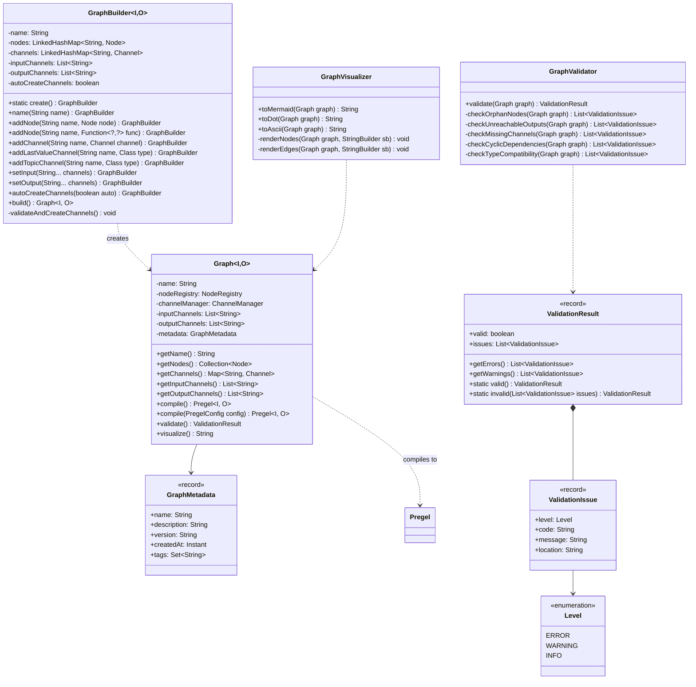

## 8. Checkpoint 详细类图

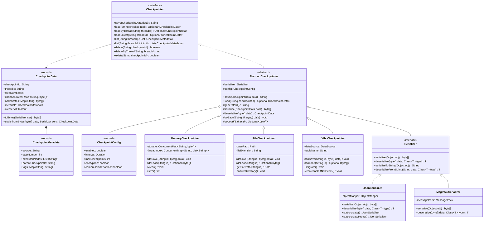

## 9. 数据流图

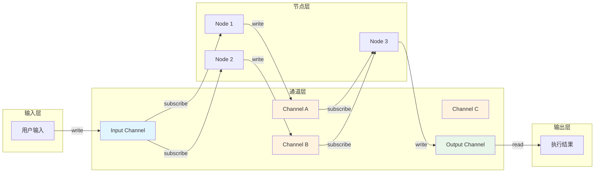

## 10. 并发执行模型

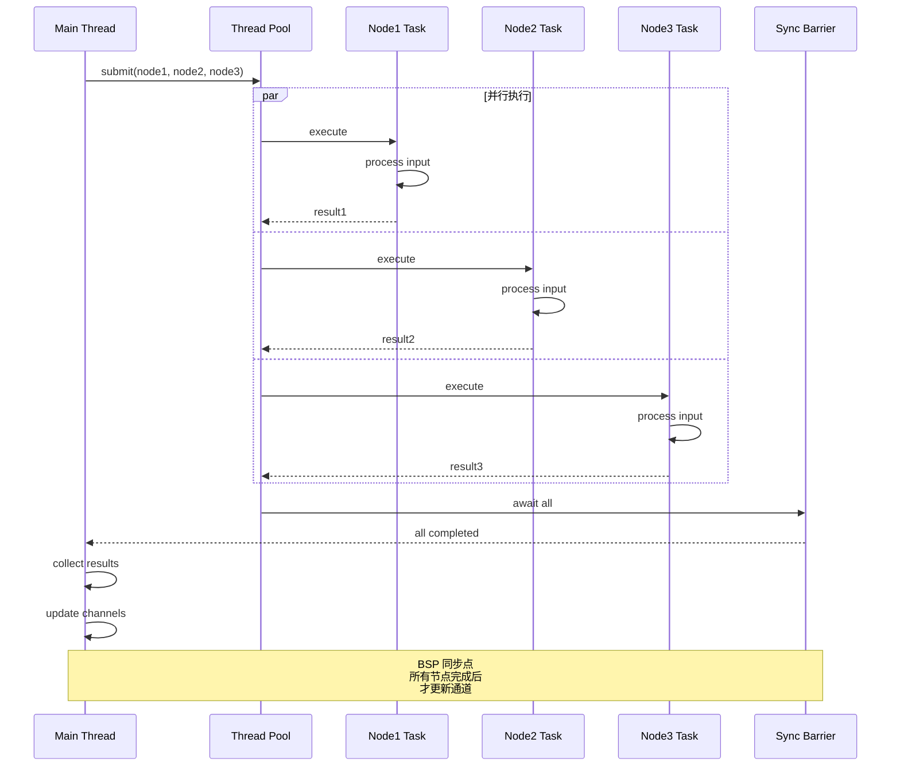

## 11. 组件交互时序图

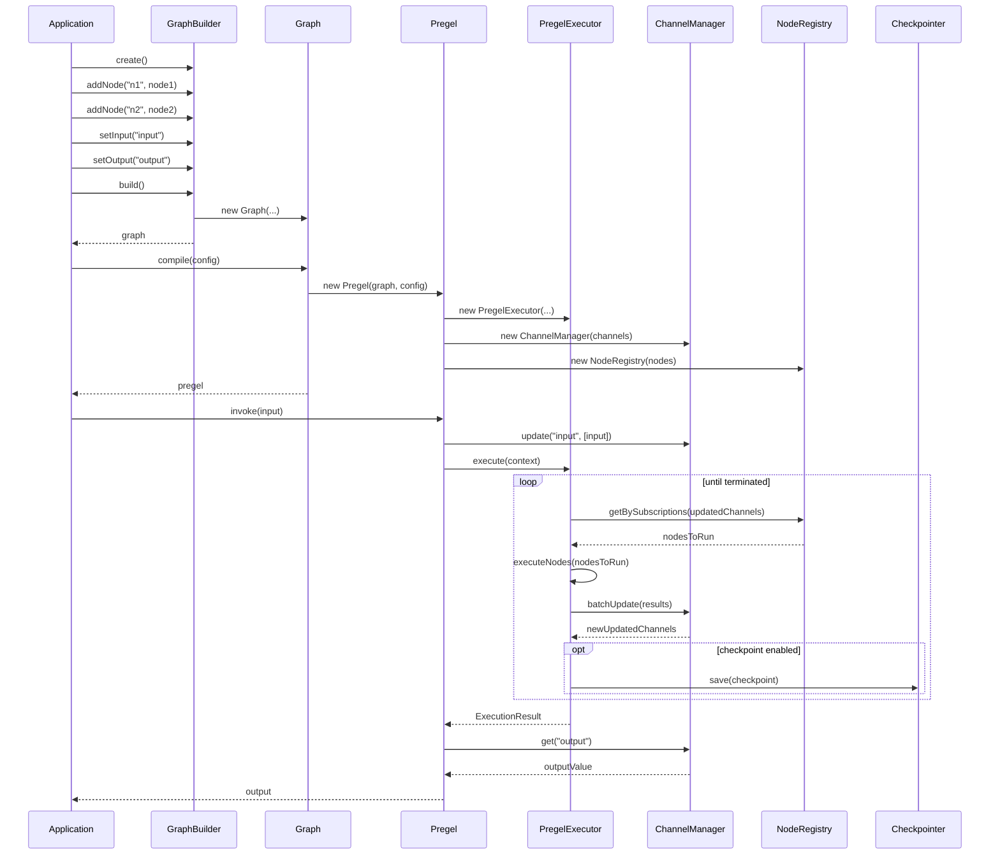